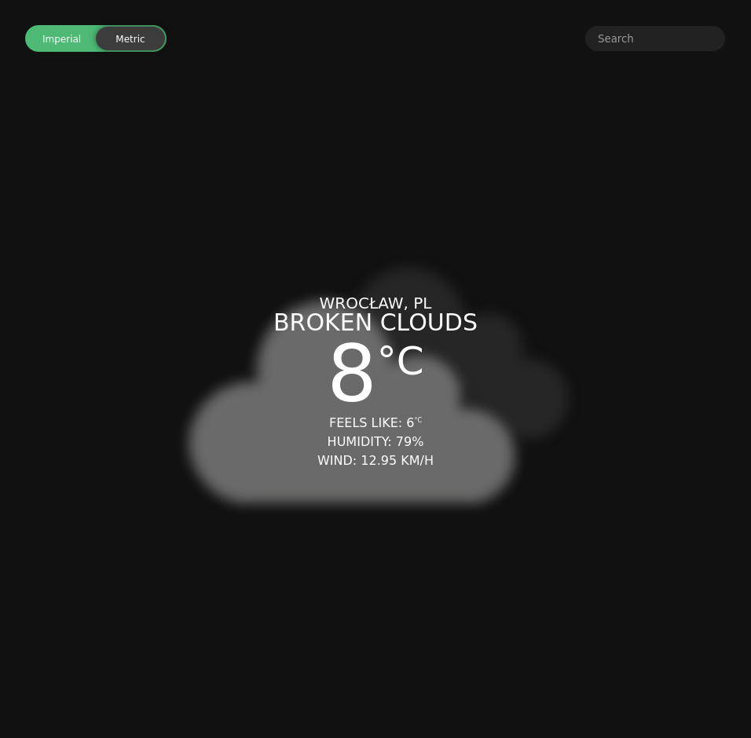

# weather-app

Weather app from TOP

[View live](https://mmxwillow.github.io/weather-app)

## What I've used:

* API: [OpenWeather](https://openweathermap.org/)
* ES6 modules compiled with Webpack
* Async/Await